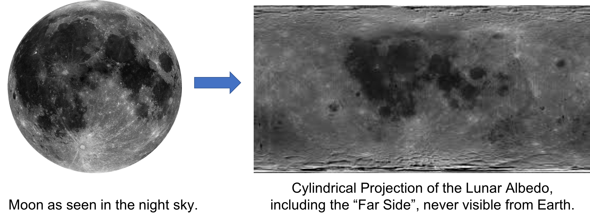

Lunar Albedo Challenge

Albedo is a measure of reflectivity of a surface. On a body such as the Moon, many different elements contribute to varying extents. This means that, in general, the albedo is related to the underlying elemental composition.

The purpose of this challenge is to use the Moon's albedo to predict the elemental composition of the surface. Contestants are provided with four different elemental maps and the albedo map. The element maps were made using data collected by the Lunar Prospector. All maps have a region withheld, i.e. the albedo and all compositions are set to zero. The final entry will be evaluated on this region. Using the machine learning method of choice, the contestant will make models that predict the composition of each element. Every element should be predicted with its own model.

An example notebook is provided. This serves as an introduction to the problem and provides a trivial solution. The method given in the notebook can be improved upon significantly. Final entries will be scored using the combined mean-squared error of all elemental predictions in the withheld region.

BE SURE NOT TO TRAIN OR TEST ON THE WITHHELD REGION! This will significantly decrease the performance when the actual data from the withheld region is used for evaluation.

The contact for this challenge is Jason Terry (jpterry@uga.edu).