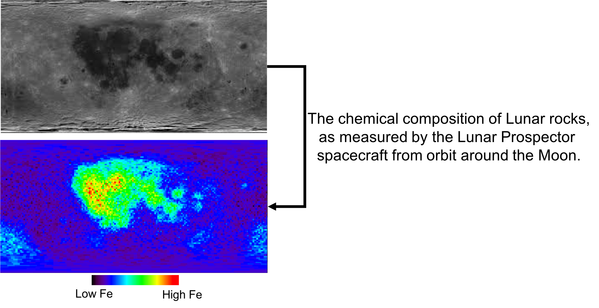

# Lunar Albedo Challenge

Albedo is a measure of reflectivity of a surface. On a body such as the Moon, many different elements contribute to varying extents. This means that, in general, the albedo is related to the underlying elemental distribution.

The purpose of this challenge is to use the lunar albedo to predict the elemental composition of the surface. Contestants are provided with four different elemental maps and the albedo map. All maps have a region withheld, i.e. the albedo and all compositions are set to zero. The final submission will be evaluated on this region. Using a machine learning method of choice, the contestant will make models that predict the distribution of each element. All elements may be predicted with the same model or each can be predicted with different models.

# Example

An example notebook is provided. This serves as an introduction to the problem and provides a trivial solution. The method given in the notebook can be improved upon significantly. Final entries will be scored using the combined mean-squared error of all elemental predictions in the withheld region.

BE SURE NOT TO TRAIN OR TEST ON THE WITHHELD REGION! There is data in this region, but all values are zero. Using this data will significantly decrease the performance when the actual data from the withheld region is used for evaluation.

# Deliverables
* Google Colab Jupyter Notebook showing your solution along with the final model score More details regarding the format of the notebook can be found in the sample Google Colab notebook provided for this challenge.  
* A txt file for each element containing your predictions on the test data. Format should be: x_coordinate, y_coordinate, predicted_value. Put name of element in file. An example is provided.
* The final trained model including the model architecture and the trained weights (For example: HDF5 file, .pb file, .pt file, etc.). You are free to choose Machine Learning Framework of your choice.
* Example submissions can be found https://drive.google.com/drive/folders/1EsqNLc5DzCsaJuvSTYF85gMS5PTVell4?usp=sharing

# Contributors

* Sergei Gleyzer (Department of Physics & Astronomy, University of Alabama)
* Patrick Peplowski (Applied Physics Laboratory, Johns Hopkins)
* Georgios Pipilis (National Technical University of Athens)
* Sonya Strukova (Universidad de Murcia)
* Jason Terry (Department of Physics & Astronomy, University of Georgia )

The contact for this challenge is Jason Terry (jpterry@uga.edu).
